# 9. Database Design

- **Engine:** PostgreSQL 16 with the `pgvector`, `pgcrypto`, `citext` and `pg_trgm` extensions.
- **Full DDL:** [`database/schema.sql`](database/schema.sql). It creates 58 tables plus the audit-log partition, 3 views and 2 access-control functions.
- **Tested:** the file loads cleanly into `pgvector/pgvector:pg16`, and the views and functions were checked with sample data (§9.9).

In the codebase, the **Alembic migrations** will be the source of truth; this file is the reference they're generated to match.

## 9.1 Design principles

| Decision | Why |
|----------|-----|
| **Authentik owns credentials; the portal owns academic data** | `users` only links an Authentik identity (`idp_subject`) to portal records and caches its claims. Roles are mirrored from Authentik groups; fine-grained rights (which classes a lecturer teaches) stay in portal tables. |
| **`users` (login) is separate from `people` (the human)** | An applicant, student, lecturer and library borrower are the same person at different times. Personal details live once in `people`, and `students` and `staff` hang off it. The application record carries over unchanged when someone is accepted. |
| **Roles are a join table (`user_roles`)**, not a column | One person can hold several roles, e.g. a lecturer who is also an admissions officer. |
| **UUID primary keys** on entities, `bigint identity` on high-volume child rows | UUIDs are safe to expose in URLs and to merge from imports. Bigints keep large tables (chunks, messages, events) compact. |
| **Enums for stable sets, lookup tables for editable lists** | Status values rarely change, so enums fit. District codes and ZIMSEC subjects need admin edits (the district sources conflict, see research §1.3), so they're tables. |
| **The national ID is stored three ways** | Ciphertext (`national_id_enc`, AES-GCM, key held outside the DB) for the real value. A keyed hash (`national_id_hmac`, unique) finds duplicates without decrypting. A masked string for display. A DB dump alone never exposes ID numbers. |
| **Extraction is stored per field (`document_fields`)** | The review screen shows each field's confidence, image region, and whether the applicant changed it. `edited_by_applicant` is a generated column, so it can't drift out of sync. |
| **Publication is a timestamp** (`published_at`, `results_published_at`, `marks_released_at`) | Staff can draft and schedule work. The student-facing views filter on it, so nothing leaks early. |
| **Access rules live in the database** (`kb_visible_documents`, `announcements_for_user`) | The assistant's retrieval and the dashboard share one tested definition of "who may see what". |
| **Audit log is partitioned by month and has no foreign keys** | It stays fast as it grows, old months can be dropped under the retention policy, and entries survive user deletion. |

## 9.2 Entity-relationship overview

The diagram shows the main entities; lookup and bookkeeping tables are omitted. GitHub and most Markdown viewers render Mermaid.

```mermaid
erDiagram
    users ||--o{ user_roles : has
    users ||--o| people : "logs in as"
    people ||--o| students : "is a"
    people ||--o| staff : "is a"
    people ||--o{ applications : submits

    intakes ||--o{ applications : "for"
    programmes ||--o{ applications : "applies to"
    applications ||--o{ documents : uploads
    documents ||--o{ document_fields : "extracted into"
    applications ||--o{ exam_sittings : claims
    exam_sittings ||--o{ exam_subject_results : contains
    applications ||--o{ application_flags : "risk signals"
    applications ||--o{ application_events : history
    applications ||--o| students : "becomes"

    departments ||--o{ programmes : runs
    programmes ||--o{ programme_modules : includes
    modules ||--o{ programme_modules : "part of"
    modules ||--o{ module_offerings : "taught as"
    academic_terms ||--o{ module_offerings : "in"
    module_offerings ||--o{ offering_lecturers : "taught by"
    staff ||--o{ offering_lecturers : teaches
    students ||--o{ enrolments : takes
    module_offerings ||--o{ enrolments : has
    module_offerings ||--o{ timetable_slots : scheduled

    module_offerings ||--o{ assessments : sets
    assessments ||--o{ submissions : receives
    students ||--o{ submissions : makes
    students ||--o{ module_results : earns
    module_offerings ||--o{ module_results : grades
    module_offerings ||--o{ course_materials : "notes"

    announcements ||--o{ announcement_targets : "shown to"
    announcements ||--o{ announcement_reads : "read by"

    library_items ||--o{ library_copies : has
    library_copies ||--o{ library_loans : "lent in"
    people ||--o{ library_loans : borrows

    kb_documents ||--o{ kb_chunks : "split into"
    users ||--o{ chat_sessions : starts
    chat_sessions ||--o{ chat_messages : contains
```



## 9.3 Tables by domain

### Identity & access
| Table | Purpose | Key constraints |
|-------|---------|-----------------|
| `users` | Portal anchor for an **Authentik** account ([10](10-authentication.md)): OIDC `sub`, Authentik pk, cached email/phone/name claims, active flag. **No passwords, MFA secrets or OTPs.** | `idp_subject` unique, not null; `email` citext unique; `phone` E.164 (`+263…`) |
| `user_roles` | Mirror of Authentik group membership (`portal-students` → `student`, …), rewritten at each login or token refresh | PK `(user_id, role)`; `idp_group` records the source group |
| `web_sessions` | Backend-for-frontend sessions: hashed cookie, encrypted refresh/ID tokens, OIDC `sid`, device info, revocation reason | Only the sha256 of the cookie is stored |
| `idp_events` | Webhook calls from Authentik notification rules (e.g. user disabled → revoke sessions) | `event_uuid` unique, so each event is processed once |
| `people` | Name, date of birth, gender, national ID (encrypted, HMAC, masked), districts, next of kin, photo | `national_id_hmac` unique, which blocks duplicate identities |

### Reference data
| Table | Purpose |
|-------|---------|
| `district_codes` | Two-digit ID district codes, with a `notes` column for known source conflicts |
| `zimsec_subjects` | Subject code + level → name, with `aliases[]` for OCR fuzzy matching |
| `grading_scales`, `grading_bands` | Mark → grade mapping per programme (Distinction/Merit/Pass, or A–F) |

### Academic structure
| Table | Purpose |
|-------|---------|
| `departments`, `programmes` | `programmes.entry_rules` (jsonb) holds the editable admission rules from [03 §3.5](03-ocr-and-id-pipeline.md#35-eligibility-rules) |
| `modules`, `programme_modules` | A module can belong to several programmes, at a given term, as core or elective |
| `academic_terms`, `intakes` | A partial unique index allows only **one** current term |
| `venues` | Rooms and labs, used by the timetable and tests |

### Onboarding
| Table | Purpose |
|-------|---------|
| `applications` | One per person × intake × programme. Holds status, eligibility with a rule-by-rule explanation, risk score, assigned officer, decision, and **consent timestamps** (processing, AI) |
| `application_events` | Status history and comments (optionally visible to the applicant) |
| `documents` | Uploaded file metadata, SHA-256 (duplicate detection), quality score, OCR engine/text/confidence, the full `extracted` jsonb |
| `device_handoffs` | "Continue on your phone" links: hashed single-use token and short code, match code, 15-minute claim window, phone session hash and expiry, revocation ([10 §10.10](10-authentication.md#1010-desktop-to-phone-handoff)). `documents.handoff_id` records uploads made from the phone. |
| `document_fields` | Per-field OCR value / LLM value / confirmed value, confidence, bounding box |
| `exam_sittings` | ZIMSEC level, session, year, **6-digit centre**, **4-digit candidate**, candidate name, verification status |
| `exam_subject_results` | Subject code/name/grade. Grade is limited to the ZIMSEC vocabulary (A–E, O, F, U, X, M, M-W, M-W-N) |
| `application_flags` | Risk signals from [03 §3.4](03-ocr-and-id-pipeline.md#34-fraud-and-risk-signals), resolvable by staff |
| `zimsec_verification_batches`, `…_items` | Export batches sent to ZIMSEC's confirmation service, with the outcome per sitting |

### Teaching
| Table | Purpose |
|-------|---------|
| `staff` | Staff number, title, department, office, contacts (`show_phone_to_students` opt-in), consultation hours |
| `students` | Student number, programme, intake, study mode, term of study, class group, status, **fee clearance** (synced from finance) |
| `module_offerings` | A module taught in a term to a class group. Links to the LMS course; `results_published_at` gates results |
| `offering_lecturers` | Lecturers per offering, with role (lead/assistant/tutor) |
| `enrolments` | Student ↔ offering, repeat flag, drop date |
| `timetable_slots`, `timetable_exceptions` | Weekly recurring slots, plus one-off cancellations and moves |

### Assessments & results
| Table | Purpose |
|-------|---------|
| `assessments` | Tests, assignments, practicals and projects: due time, duration, venue, weight, max mark, submission mode, late window, publish and mark-release times |
| `submissions`, `submission_files` | One submission per student per assessment. Files carry SHA-256 for the receipt |
| `module_results` | Coursework/exam/final mark, grade, pass flag, remarks, who entered and approved |

### Content
| Table | Purpose |
|-------|---------|
| `course_materials` | Notes per offering, by week/topic; a file in MinIO or an external link |
| `announcements`, `announcement_targets` | Audience rules (see §9.5), pin, must-acknowledge, schedule, expiry |
| `announcement_reads` | Read and acknowledgement tracking |
| `attachments` | Files on announcements or assessments (exactly one parent) |

### Library
| Table | Purpose |
|-------|---------|
| `library_items`, `library_copies` | A title and its physical copies (barcode, location, status). Trigram index for title search |
| `library_loans` | A partial unique index stops a copy being lent twice at once. Fines stored in USD by default |
| `library_pages` | Opening hours, rules, e-resources, contacts (Markdown) |

### AI assistant
| Table | Purpose |
|-------|---------|
| `kb_documents` | One row per indexed source (note, announcement, handbook section, library page), with its **visibility scope**. `content_hash` skips re-embedding unchanged content |
| `kb_chunks` | Text chunks with a `vector(1024)` embedding (bge-m3) and an **HNSW** cosine index |
| `chat_sessions`, `chat_messages` | Full API content blocks (append-only history), token usage including cache reads, cited chunks, 👍/👎 feedback |

### Notifications
`notification_preferences` (category × channel), `push_subscriptions` (Web Push), `notifications` (in-app inbox), and `notification_deliveries` (per-channel attempts). `notifications.dedupe_key` is unique per user, so the "24 h before the test" reminder can never be sent twice.

### Compliance & integration
`audit_log` (partitioned), `data_subject_requests` (30-day due date by default), `retention_runs` (proof of what was deleted), and `import_runs` (CSV/Moodle/Koha/finance sync results).

## 9.4 Onboarding lifecycle in data

```
applications.status: draft → submitted → in_review ─┬→ accepted  → students row created (application_id set)
                                     ↑              ├→ rejected  → documents purged after 180 days
                                     └─ more_info ←─┘   (withdrawn possible from any open state)

documents.status:    uploaded → processing → extracted → confirmed (applicant) → approved (staff)
                                          └→ failed (retake prompt)          └→ rejected
```

Every status change writes an `application_events` row and an `audit_log` row.

## 9.5 Audience targeting

`announcement_targets` holds any number of rules per announcement:

- **Within a row:** non-NULL columns must *all* match (AND).
- **Across rows:** any matching row makes the announcement visible (OR).
- **A row of all NULLs** means everyone who is signed in.

| Want | Rows |
|------|------|
| Everyone | `(NULL, NULL, NULL, NULL, NULL)` |
| All lecturers | `role = 'lecturer'` |
| DIT, first term | `programme_id = DIT, term_number = 1` |
| One class | `offering_id = <DCN201 DIT-1A 2027-S1>` |
| February intake applicants | `role = 'applicant', intake_id = 2027-FEB` |
| DIT **or** DTE | two rows |

`announcements_for_user(user_id)` applies these rules, together with publish and expiry times. Assistant retrieval uses the simpler `kb_documents.visibility` scope (`public / applicants / students / staff / programme / offering`) through `kb_visible_documents(user_id)`:

```sql
SELECT c.content, d.title
FROM kb_chunks c
JOIN kb_visible_documents($1) d ON d.id = c.document_id
ORDER BY c.embedding <=> $2      -- query embedding
LIMIT 8;
```

## 9.6 Main queries and the indexes behind them

| Screen / job | Query shape | Index |
|--------------|-------------|-------|
| Admissions queue | open applications by risk, then age | partial `applications_queue (status, risk_score DESC, submitted_at)` |
| Duplicate-document flag | same `sha256` on another application | `documents (sha256)` |
| Duplicate-candidate flag | same level/session/year/centre/candidate | `exam_sittings_candidate` |
| Worker pickup | documents still waiting | partial `documents (status) WHERE uploaded/processing` |
| Dashboard "due soon" | `v_student_upcoming_assessments` | `assessments_upcoming (offering_id, due_at) WHERE published` + `enrolments` PK |
| Class list | active enrolments of an offering | partial `enrolments (offering_id) WHERE dropped_at IS NULL` |
| Lecturer's modules | offerings for a staff member | `offering_lecturers (staff_id)` |
| Unread notifications | user inbox | partial `notifications (user_id, created_at DESC) WHERE read_at IS NULL` |
| Library search | title fuzzy match | `library_items_title_trgm` (GIN trigram) |
| Applicant name search | fuzzy name | `people_name_trgm` |
| Assistant retrieval | vector nearest neighbour, filtered | `kb_chunks_embedding` (HNSW, cosine) |
| Audit lookups | by entity or by actor | `audit_log (entity, entity_id, at)`, `(actor_id, at)` |

The dashboard runs about six indexed queries per user and is cached in Redis for 60 s ([02 §2.5](02-architecture.md#25-key-flows)).

## 9.7 Security in the database

- **Encryption:**
  - The disk is encrypted at rest (LUKS).
  - Sensitive columns are encrypted by the app: `people.national_id_enc`, and `web_sessions.refresh_token_enc` / `id_token_enc`.
  - The encryption keys live in the app's secret store, never in the DB.
- **Least privilege:**
  - `portal_app` has DML only on application tables, with no DDL and no access to `audit_log` beyond INSERT/SELECT.
  - `portal_migrate` owns the schema and is used only by Alembic.
  - `portal_readonly` is for reports and sees only views that mask national IDs.
  - `portal_backup` is for `pg_dump`.
- **Append-only audit:** revoke UPDATE/DELETE on `audit_log` from `portal_app`. Only the retention job's role may drop old partitions.
- **Optional row-level security (defence in depth):** on `people`, `students`, `module_results`, `submissions` and `documents`, add RLS policies keyed on `current_setting('app.user_id')`. The API sets this per transaction. The API's own permission checks stay the primary control.
- **No raw OCR text long-term:** `documents.ocr_text` is nulled when the document is approved.

## 9.8 Retention jobs

| Policy | Statement (run nightly by Celery beat) |
|--------|----------------------------------------|
| Rejected or withdrawn application documents | Delete `documents` (and MinIO objects) where the application was decided more than 180 days ago |
| Raw OCR text | `UPDATE documents SET ocr_text = NULL WHERE status = 'approved' AND ocr_text IS NOT NULL` |
| Chat transcripts | `DELETE FROM chat_sessions WHERE last_message_at < now() - interval '90 days'` (messages cascade) |
| Expired or revoked web sessions | Delete `web_sessions` rows past `expires_at + 7 days`; delete processed `idp_events` older than 90 days |
| Audit log | Detach and drop monthly partitions older than 24 months |

Each run inserts a `retention_runs` row as evidence for the DPO.

## 9.9 Verification performed

`schema.sql` was loaded into a fresh `pgvector/pgvector:pg16` container with `ON_ERROR_STOP`, then exercised with sample data:

- **`kb_visible_documents`:**
  - Student A (DIT, enrolled in DCN201) sees the student handbook and the DCN201 notes, but not DTE-only content or staff procedures.
  - Student B (DTE) sees the handbook and the DTE notice.
  - The DCN201 lecturer sees the DCN201 notes and the staff procedures.
- **Vector search** joined through the function returns only permitted chunks.
- **`announcements_for_user`:**
  - Student A sees the all-campus, "DIT year 1" and DCN201-class notices.
  - Student B sees only the all-campus notice.
  - The lecturer sees the all-campus, lecturer-only and their class notices.
- **`v_student_upcoming_assessments`** shows the published test and hides the unpublished draft.
- **Constraints reject bad data:** a 5-digit centre number, a non-E.164 phone number, an `offering`-scoped KB document with no offering, and a second `users` row with the same Authentik `idp_subject`.
- **Re-run after the Authentik change:** the schema still loads, and after adding `device_handoffs` it has 59 tables including the audit partition. A claim without a session, or after the 15-minute window, is rejected, and both access functions return the same results with roles mirrored from Authentik groups.

## 9.10 From this file to migrations

1. Write the SQLAlchemy 2 models in `api/app/**/models.py` to match `schema.sql`.
2. Run `alembic revision --autogenerate -m "initial schema"`. Add by hand what autogenerate misses: extensions, enums, partial/GIN/HNSW indexes, generated columns, the partitioned `audit_log`, triggers, views and functions (with `op.execute`).
3. CI check: build a DB from migrations and another from `schema.sql`, then diff them with `pg_dump --schema-only` so the two never drift.
4. After that, every change is a new Alembic migration, and `schema.sql` is regenerated from a migrated DB for documentation.
